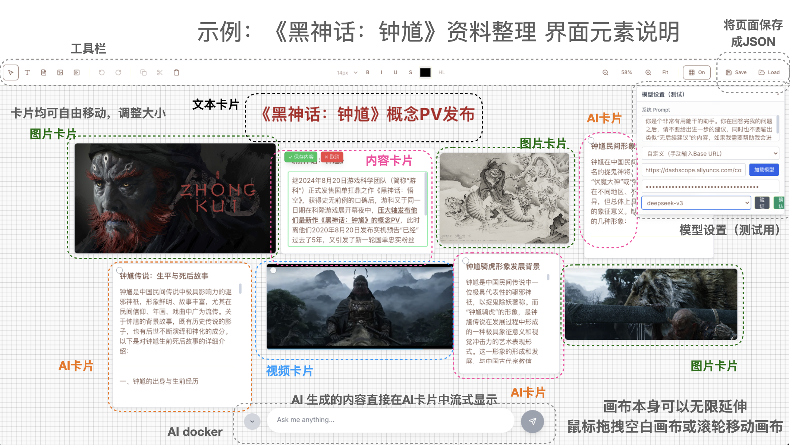

# AI Canvas for Brainstorm

一个基于 Next.js 14 + React 18 + TypeScript 的智能画布应用，专为创意团队设计，支持多种内容类型和AI辅助创作。

## 核心特性

### 统一卡片系统
- **文本卡片**：纯文本、富文本内容卡片
- **图片卡片**：支持拖拽上传、自动调整大小
- **PDF卡片**：浏览器内置PDF查看器
- **视频卡片**：支持iframe嵌入（Bilibili、YouTube等）
- **AI内容卡片**：Markdown渲染、LaTeX公式、代码高亮

### 交互体验
- **拖拽移动**：直观的卡片拖拽操作
- **智能调整**：四角/四边拉伸调整大小
- **网格对齐**：自动对齐网格，保持布局整洁
- **多选操作**：支持多卡片选择、对齐、分布

### AI集成
- **多模型支持**：OpenAI、Claude、本地模型等
- **流式输出**：实时AI响应，自动创建内容卡片
- **系统提示词**：可自定义AI行为
- **查询总结**：智能生成内容标题
- **Deep Research**：深度网络研究，自动生成研究报告

#### Deep Research 功能
Deep Research 是一个强大的研究助手，能够：
- **深度搜索**：自动搜索网络资源，收集相关信息
- **报告生成**：基于搜索结果生成结构化的研究报告
- **智能分析**：自动提取关键信息，整理成易于理解的内容
- **快速响应**：几秒钟内完成从搜索到报告生成的全过程

**使用方法**：
1. 在底部 AI 输入框上方点击 "Deep Research" 胶囊按钮
2. 按钮变为蓝色 "Deep Research ON" 表示已开启
3. 在输入框中输入你的研究问题（如："人工智能在医疗领域的应用"）
4. 按回车确认，系统会自动生成一个卡片
5. 研究完成后，内容自动更新为完整的研究报告

**适用场景**：
- 市场调研和竞品分析
- 学术研究和文献综述
- 商业决策支持
- 新闻事件深度分析
- 学习资料整理

### 项目管理
- **JSON保存**：完整保存画布状态和内容
- **一键恢复**：快速加载之前的工作
- **离线工作**：所有内容本地化存储


## 示例



## 快速开始

### 环境要求
- Node.js 18+
- npm 或 yarn
- Python 3.8+ (用于 Deep Research 后端)

### 安装运行

#### 1. 前端项目
```bash
# 克隆项目
git clone [repository-url]
cd AICanvas

# 安装依赖
npm install

# 启动开发服务器
npm run dev

# 构建生产版本
npm run build
```

#### 2. Deep Research 后端 (可选)
```bash
# 进入后端目录
cd deep-research-api

# 安装 Python 依赖
pip install -r requirements.txt

# 配置环境变量
cp .env.example .env
# 编辑 .env 文件，填入你的 OpenAI API Key

# 启动后端服务
uvicorn main:app --reload --host 0.0.0.0 --port 8000
```

**注意**：Deep Research 功能需要后端服务运行在 localhost:8000

### 基本使用
1. **创建内容**：使用工具栏工具创建不同类型的卡片
2. **编辑内容**：双击卡片进入编辑模式
3. **调整布局**：拖拽移动、拉伸调整大小
4. **AI创作**：在底部输入框提问，AI自动生成内容
5. **Deep Research**：开启研究模式，输入研究问题，自动生成研究报告
6. **保存项目**：点击Save按钮保存当前状态
7. **加载项目**：点击Load按钮恢复之前的工作

## 工具说明

### 创建工具
- **V** - 选择工具：选择和操作卡片
- **T** - 文本工具：创建纯文本卡片
- **C** - 内容卡片：创建带标题和正文的卡片
- **I** - 图片卡片：创建图片显示卡片
- **V** - 视频卡片：创建视频嵌入卡片

## 技术架构

### 前端技术栈
- **框架**：Next.js 14 (App Router)
- **状态管理**：Zustand + 命令模式
- **样式**：TailwindCSS + CSS Variables
- **富文本编辑**：TipTap Editor
- **Markdown渲染**：react-markdown + KaTeX

### 核心组件
- **CanvasRoot**：主画布组件，处理交互事件
- **CardsLayer**：卡片渲染层
- **Toolbar**：顶部工具栏
- **AIDock**：底部AI输入栏
- **ModelSelector**：AI模型配置面板

### 数据流
```
用户操作 → Canvas Store → 状态更新 → 组件重渲染 → UI更新
AI查询 → API路由 → 模型调用 → 流式响应 → 内容卡片创建
Deep Research → 前端API → 后端GPT Researcher → 研究报告 → 内容卡片更新
```

### 后端服务
- **Deep Research API**：基于 FastAPI + GPT Researcher 的研究服务
- **GPT Researcher**：开源深度研究框架，支持网络搜索和报告生成
- **异步处理**：支持长时间运行的研究任务
- **错误处理**：完善的异常处理和用户反馈

## TODO 列表

### 富文档显示增强
- [ ] **字体系统**：支持多种字体选择
- [ ] **列表功能**：有序/无序列表、任务列表
- [ ] **表格支持**：创建和编辑表格内容
- [ ] **代码块**：语法高亮
- [ ] **数学公式**：LaTeX公式编辑器
- [ ] **图表支持**：流程图、思维导图、数据图表
- [ ] **链接管理**：内部链接、外部链接、锚点

### 操作体验优化
- [ ] **移动优化**：更流畅的拖拽体验，减少卡顿
- [ ] **拉伸优化**：智能拉伸手柄，支持约束拉伸
- [ ] **旋转功能**：卡片旋转、角度约束
- [ ] **缩放优化**：画布缩放性能提升
- [ ] **选择优化**：框选、套索选择、智能选择
- [ ] **对齐辅助**：实时对齐线、吸附效果
- [ ] **卡片内容输入大模型**：选中卡片的内容可以和query一起输入到大模型中

### 媒体内容优化
- [ ] **图片固定比例**：保持原始宽高比，智能裁剪
- [ ] **图片大小问题**：自动优化图片尺寸，减少内存占用
- [ ] **PDF显示优化**：多页支持、缩放控制、搜索功能
- [ ] **视频重播问题**：解决画布移动后视频重新加载的问题
- [ ] **音频支持**：音频文件播放、波形显示

### AI功能增强
- [ ] **多轮对话**：支持上下文对话，记忆对话历史
- [ ] **内容分析**：AI分析现有内容，提供改进建议
- [ ] **智能布局**：AI自动优化卡片布局
- [ ] **内容生成**：基于模板的内容生成
- [ ] **Deep Research 增强**：支持多语言研究、自定义研究深度、研究结果导出
- [ ] **研究历史**：保存研究记录，支持重复使用和对比分析

### 系统优化
- [ ] **性能优化**：大量卡片时的渲染性能
- [ ] **内存管理**：图片、PDF等大文件的内存优化
- [ ] **离线支持**：PWA支持，完全离线工作
- [ ] **数据同步**：云端同步、多设备协作
- [ ] **版本控制**：项目版本管理、分支功能

### 用户体验
- [ ] **主题系统**：深色/浅色主题、自定义主题
- [ ] **导入导出**：多种格式支持（PNG、SVG、PDF）


## 贡献指南

欢迎提交 Issue 和 Pull Request！

### 开发环境设置
```bash
# 安装依赖
npm install

# 代码检查
npm run lint

# 类型检查
npm run type-check

# 测试运行
npm run test
```

### 代码规范
- 使用 TypeScript 严格模式
- 遵循 ESLint 规则
- 组件使用函数式组件 + Hooks
- 状态管理使用 Zustand
- 样式使用 TailwindCSS

## 许可证

MIT License

## 致谢

感谢所有为这个项目做出贡献的开发者和用户！

---

**AI Canvas for Brainstorm** - 让创意无限可能
